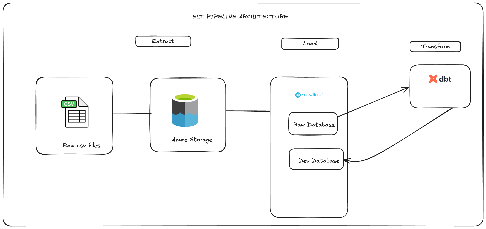
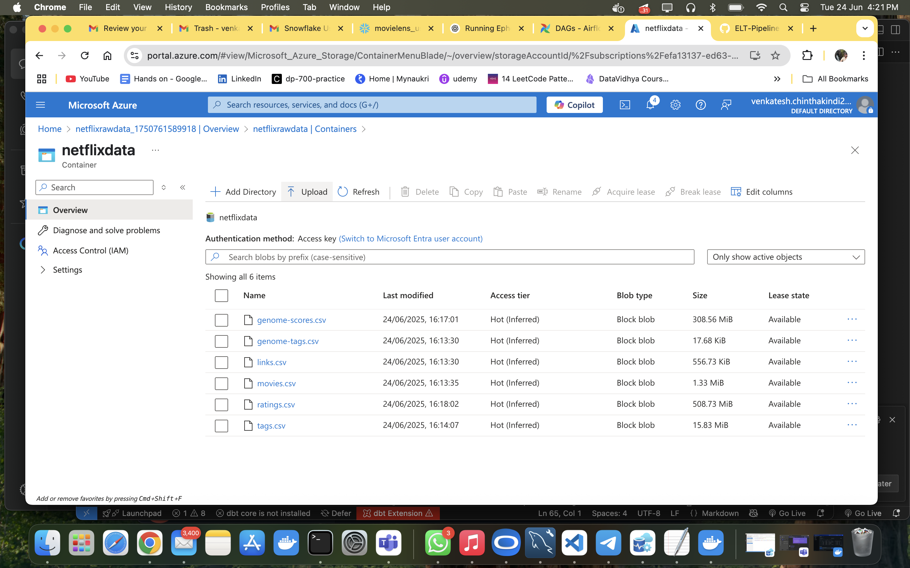
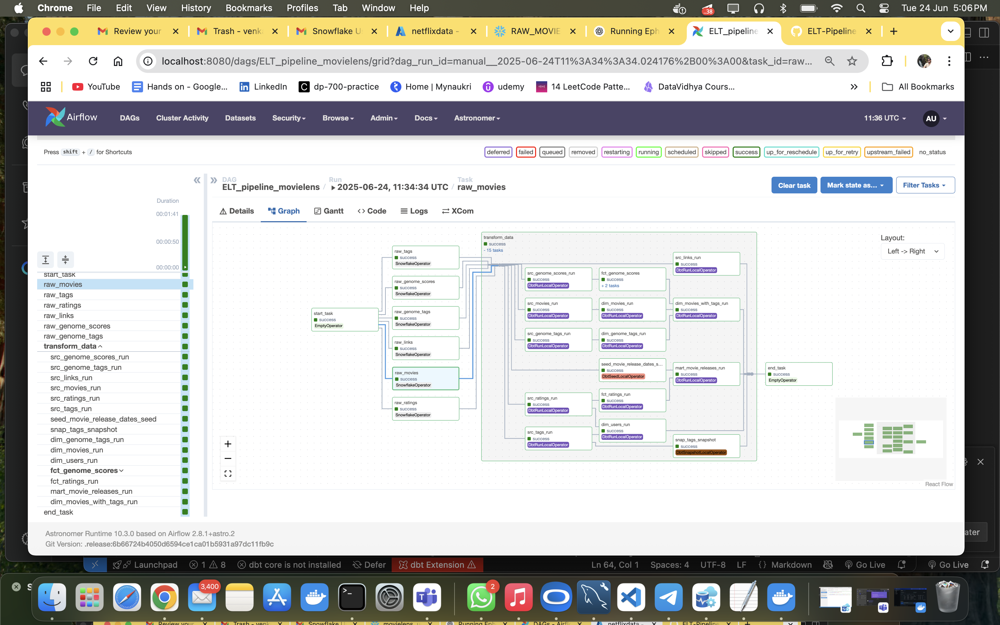

### Welcome to Netflix( Movilens) ELT Pipeline
This project demonstrates an end-to-end ELT (Extract, Load, Transform) pipeline using Azure Storage for raw data ingestion, Snowflake as the cloud data warehouse, and dbt for data transformations and data modeling and airflow for orchestration.

### 🏗️ Architecture Diagram

Below is the high-level architecture of the pipeline:



### 🗂️ Resources

- For datasets, please visit [MovieLens](https://grouplens.org/datasets/movielens/20m/)




### ⚙️ Snowflake 
Queries to setup datawarehouse,role,user,database,schema,tables and copy the data from Azure storage [Snowflake](https://github.com/Venkatesh-admin/ELT-Pipeline-For-Movielens-Data-Using-ADLS-Snowflake-DBT/tree/master/snowflake)


### ⚙️ Key dbt Commands in development mode

Run these commands from your dbt project root folder after deveolping models

#### 🔨 Build Models
```bash
dbt build
````

#### 🏗️ Run Specific Models

```bash
dbt run --select model_name
```

#### 🧪 Run Tests

```bash
dbt test
```

#### 📄 Generate Documentation

```bash
dbt docs generate
```

#### 🌐 Serve Documentation Locally

```bash
dbt docs serve
```

#### 📊 Run Analysis Queries

```bash
dbt compile --select path:analyses/
```

### Airflow Sample pipeline

Use SnowflakeOperator to copy data from the azure storage and DbtTaskGroup to execute dbt models





